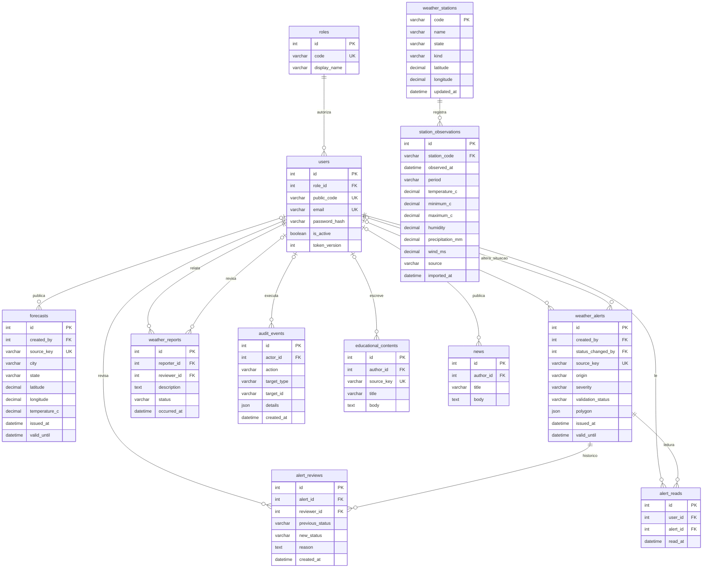

# Modelo Entidade-Relacionamento — PrevClima

O modelo separa identidade, comunicação meteorológica e dados medidos. As migrações Alembic são a fonte executável do esquema. A revisão `3b6f82078bcf` acrescenta estações e observações sem apagar dados existentes.

## Regras e unidades

| Entidade | Regra |
|---|---|
| Estação | Código INMET/OMM único; metadados compartilhados por todas as medições. Coordenadas desconhecidas ficam nulas. |
| Observação | Chave natural única `(station_code, observed_at, period)`. Período `HOURLY`, `DAILY` ou `MONTHLY`; UTC no armazenamento e na API. |
| Medidas | Temperatura em °C, umidade em %, precipitação em mm e vento em m/s. Campo ausente ou sentinela `-9999` vira `NULL`, nunca zero. |
| Previsão | Produto previsto, separado da medição observada. A probabilidade de chuva não é inferida de precipitação medida. |
| Aviso | Origem `INMET`, `MANUAL` ou `DEMO`; validade e situação de revisão independentes. |
| Revisão | Registra autor, motivo, situação anterior e nova. Não apaga o alerta. |
| Leitura | Restrição única `(user_id, alert_id)`. |
| Auditoria | `target_type` + `target_id` identificam vários tipos de entidade e não são uma chave estrangeira. |
| Conta | Desativação preserva histórico e revoga sessões via `token_version`. |

Os atributos do diagrama são os principais campos de cada entidade. O inventário completo, tipos, índices e restrições está em [schema.mysql.sql](schema.mysql.sql). O modelo usa tabelas relacionais para identidade e medições; JSON permanece apenas onde a estrutura é variável (geometrias, recomendações e detalhes de auditoria).

## Aplicação e reversão

Em uma cópia de desenvolvimento: `alembic upgrade head` e `alembic check`. Em um banco existente, faça backup e use a migração incremental. O SQL de criação completo é para bancos vazios. A reversão com `alembic downgrade 5f0e7c29b4a1` remove as duas novas tabelas e seus dados; não é necessária para atualizar.
